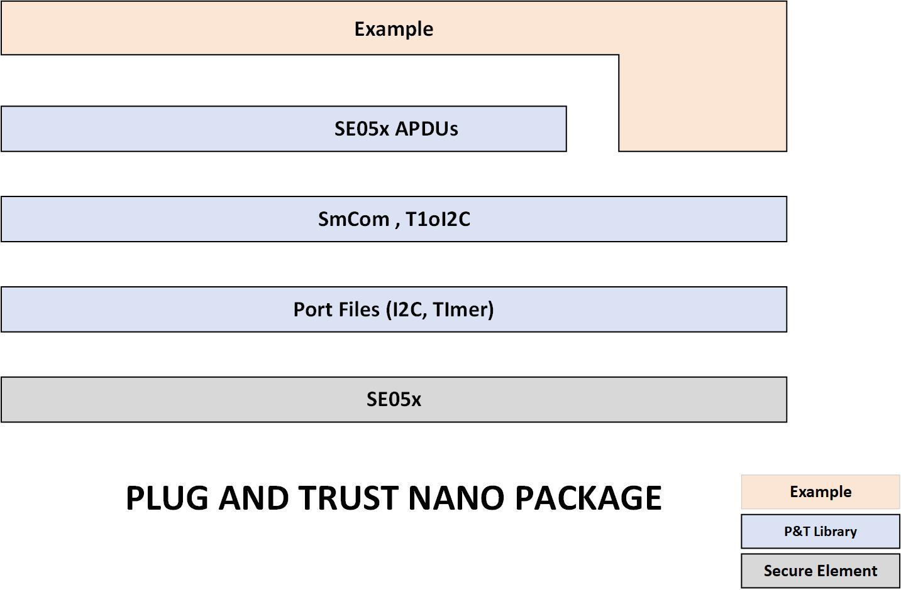

.. _introduction:

Introduction
============

Introduction to the Plug & Trust Nano Package
---------------------------------------------

The Plug & Trust Nano package is an optimized middleware for communicating between a host processor or microcontroller and
the EdgeLock SE05x and A5000 secure elements and authenticators. The Plug & Trust Nano Package has been designed for memory constrained
devices and consumes only ~1KB of RAM for SCP03 encrypted communication over I2C.

Note that the examples and libraries contained in the Plug & Trust Nano package have been specifically designed to fit into constrained devices
and are not compatible with examples and libraries available in the standard Plug & Trust package.

*The standard Plug and Trust middleware package can be downloaded from https://www.nxp.com/products/:SE050.
The package has support for more crypto curves, plugins, examples and more platforms.*

Nano Package -

**Nano package Features**

	- ECDSA and ECDH with NIST P256, NIST P384
	- AES Encrypt / Decrypt (ECB,CBC,CTR)
	- Binary Objects
	- Encrypted I2C communication using PlatformSCP channel based on Global Platform SCP03 channel
	- EC Key Authentication
	- EC Key Authentication in combination with PlatformSCP03
	- Platforms - Linux, frdm-k64 bare metal, mcxn947/mcxa153 bare metal, Zephyr OS

**Folder structure**

::

	example --- se05x examples
	lib  ------ se05x library files
	 |
	 |__
		apdu -------- Contains se05x apdu apis with scp03 / eckey auth support
		platform ---- Platform specific files. Modify / add the files here to support other platform
		t1oi2c ------ T1OI2C files
		mbedtls_alt - Mbedtls ALT files to access SE05x

PlatformSCP03
-------------

Using nano package, host can establish encrypted I2C communication via PlatformSCP channel
(based on Global Platform SCP03). This requires some host crypto operations.

	Plug and Trust Nano package has these host crypto apis implemented using
		- openssl (version 1.1.1). (simw-nanopkg/lib/apdu/scp03/openssl)
		- tinyCrypt (simw-nanopkg/lib/apdu/scp03/tc)
		- mbedtls (simw-nanopkg/lib/apdu/scp03/mbedtls)

To use a different host crypto, re-implement the host crypto apis -
`simw-nanopkg/lib/apdu/scp03/se05x_scp03_crypto.h`

When building the example with 'Platform SCP' enabled, make sure to assign valid scp03 keys to session context.
(DEK key is required only for key rotation - se05x_rotate_scp03_keys).

.. note::

	Product Deployment => Make sure to store the SCP03 keys securely.

The Default Platform SCP keys for ease of use configurations are present in
	- SE050 Configuration: https://www.nxp.com/docs/en/application-note/AN12436.pdf
	- SE051 Configuration: https://www.nxp.com/webapp/Download?colCode=AN12973

.. code-block:: c

	void ex_set_scp03_keys(pSe05xSession_t session_ctx)
	{
	    session_ctx->pScp03_enc_key    = &scp03_enc_key[0];
	    session_ctx->pScp03_mac_key    = &scp03_mac_key[0];
	    session_ctx->pScp03_dek_key    = NULL;
	    session_ctx->scp03_enc_key_len = 16;
	    session_ctx->scp03_mac_key_len = 16;
	    session_ctx->scp03_dek_key_len = 0;
	    return;
	}

EC-Key Auth
-----------

Using nano package, host can establish Eckey authentication with applet.
This requires some host crypto operations.

	Plug and Trust Nano package has these host crypto apis implemented using
		- openssl (version 1.1.1). (simw-nanopkg/lib/apdu/scp03/openssl)
		- tinyCrypt (simw-nanopkg/lib/apdu/scp03/tc)
		- mbedtls (simw-nanopkg/lib/apdu/scp03/mbedtls)

To use a different host crypto, re-implement the host crypto apis -
`simw-nanopkg/lib/apdu/scp03/se05x_scp03_crypto.h`

When building the example with 'EC Key Authentication' enabled, make sure to assign valid eckey keys to session context.

.. note::

	Product Deployment => Make sure to store the EC keys securely.

.. code-block:: c

	void ex_set_ec_auth_keys(pSe05xSession_t session_ctx)
	{
	    session_ctx->pEc_auth_key    = &ec_auth_key[0];
	    session_ctx->ec_auth_key_len = sizeof(ec_auth_key);
	    return;
	}

Build option
------------

plain Session ::

	-DPLUGANDTRUST_SE05X_AUTH:STRING=None : Plain Session

Platform SCP03 ::

	-DPLUGANDTRUST_SE05X_AUTH:STRING=PlatfSCP03 : Build with Platform SCP03 enabled

EcKey Authentication ::

	-DPLUGANDTRUST_SE05X_AUTH:STRING=ECKey : Build with ECKey Authentication enabled

EcKey and Platform SCP03 combined ::

	-DPLUGANDTRUST_SE05X_AUTH:STRING=ECKey_PlatSCP03 : Build with EcKey and Platform SCP03 combined

Debug Logs ::

	-DPLUGANDTRUST_DEBUG_LOGS=ON : Build with Debug logs enabled
	-DPLUGANDTRUST_DEBUG_LOGS=OFF : Build with Debug logs disabled

Examples
--------

**Examples on linux**

`se05x_sign Linux`_.

.. _se05x_sign Linux: https://github.com/NXPPlugNTrust/nano-package/blob/master/examples/se05x_sign/readme.rst

`se05x_crypto Linux`_.

.. _se05x_crypto Linux: https://github.com/NXPPlugNTrust/nano-packag/blob/master/examples/se05x_crypto/readme.rst

`se05x_GetInfo Linux`_.

.. _se05x_GetInfo Linux: https://github.com/NXPPlugNTrust/nano-package/blob/master/examples/se05x_GetInfo/readme.rst

`se05x_mandate_scp03 Linux`_.

.. _se05x_mandate_scp03 Linux: https://github.com/NXPPlugNTrust/nano-package/blob/master/examples/se05x_mandate_scp03/readme.rst

`se05x_resume_scp03 Linux`_.

.. _se05x_resume_scp03 Linux: https://github.com/NXPPlugNTrust/nano-package/blob/master/examples/se05x_resume_scp03/readme.rst

`se05x_ReadIDList Linux`_.

.. _se05x_ReadIDList Linux: https://github.com/NXPPlugNTrust/nano-package/blob/master/examples/se05x_ReadIDList/readme.rst

`se05x_eckey_session_provision Linux`_.

.. _se05x_eckey_session_provision Linux: https://github.com/NXPPlugNTrust/nano-package/blob/master/examples/se05x_eckey_session_provision/readme.rst

**Examples on FRDM-K64F**

`se05x_sign k64f`_.

.. _se05x_sign k64f: https://github.com/NXPPlugNTrust/nano-package/blob/master/examples/se05x_sign/k64f/readme.rst

`se05x_crypto k64f`_.

.. _se05x_crypto k64f: https://github.com/NXPPlugNTrust/nano-package/blob/master/examples/se05x_crypto/k64f/readme.rst

`se05x_GetInfo k64f`_.

.. _se05x_GetInfo k64f: https://github.com/NXPPlugNTrust/nano-package/blob/master/examples/se05x_GetInfo/k64f/readme.rst

`se05x_mandate_scp03 k64f`_.

.. _se05x_mandate_scp03 k64f: https://github.com/NXPPlugNTrust/nano-package/blob/master/examples/se05x_mandate_scp03/k64f/readme.rst

`se05x_rotate_scp03_keys k64f`_.

.. _se05x_rotate_scp03_keys k64f: https://github.com/NXPPlugNTrust/nano-package/blob/master/examples/se05x_rotate_scp03_keys/k64f/readme.rst

`se05x_ReadIDList k64f`_.

.. _se05x_ReadIDList k64f: https://github.com/NXPPlugNTrust/nano-package/blob/master/examples/se05x_ReadIDList/k64f/readme.rst

`se05x_eckey_session_provision k64f`_.

.. _se05x_eckey_session_provision k64f: https://github.com/NXPPlugNTrust/nano-package/blob/master/examples/se05x_eckey_session_provision/k64f/readme.rst

**Examples on FRDM-MCXN**

`se05x_sign mcxn`_.

.. _se05x_sign mcxn: https://github.com/NXPPlugNTrust/nano-package/blob/master/examples/se05x_sign/mcxn947/readme.rst

`se05x_crypto mcxn`_.

.. _se05x_crypto mcxn: https://github.com/NXPPlugNTrust/nano-package/blob/master/examples/se05x_crypto/mcxn947/readme.rst

`se05x_GetInfo mcxn`_.

.. _se05x_GetInfo mcxn: https://github.com/NXPPlugNTrust/nano-package/blob/master/examples/se05x_GetInfo/mcxn947/readme.rst

`se05x_mandate_scp03 mcxn`_.

.. _se05x_mandate_scp03 mcxn: https://github.com/NXPPlugNTrust/nano-package/blob/master/examples/se05x_mandate_scp03/mcxn947/readme.rst

`se05x_rotate_scp03_keys mcxn`_.

.. _se05x_rotate_scp03_keys mcxn: https://github.com/NXPPlugNTrust/nano-package/blob/master/examples/se05x_rotate_scp03_keys/mcxn947/readme.rst

**Examples on FRDM-MCXA**

`se05x_sign mcxa`_.

.. _se05x_sign mcxa: https://github.com/NXPPlugNTrust/nano-package/blob/master/examples/se05x_sign/mcxa153/readme.rst

`se05x_crypto mcxa`_.

.. _se05x_crypto mcxa: https://github.com/NXPPlugNTrust/nano-package/blob/master/examples/se05x_crypto/mcxa153/readme.rst

`se05x_GetInfo mcxa`_.

.. _se05x_GetInfo mcxa: https://github.com/NXPPlugNTrust/nano-package/blob/master/examples/se05x_GetInfo/mcxa153/readme.rst

**Examples on Zephyr OS**

Integration of nano package in Zephyr OS (Tested with release tag - zephyr-v3.7.0).

Refer `Zephyr Readme`_.

.. _Zephyr Readme: https://github.com/NXPPlugNTrust/nano-package/blob/master/zephyr/readme.rst

.. note::

	To use policies with objects refer 'test_nist256_sign_policy' in 'Se05x Crypto' example.
	For more details on policies, Refer Section '3.7 Policies' in https://www.nxp.com/docs/en/application-note/AN12413.pdf

Porting
-------

Platform specific files are maintained in **simw-nanopkg/lib/platform** folder.

Modify / add the files here to support other platforms. By default port files are available for Linux, Zephyr, MCXN947, MCXA153 and K64 MCU.

Mbedtls Alt files
-----------------

Nano package provides MbedTLS Alt files as an alternative/additional approach to access the secure element using mbedTLS.

In the current implementation only ECDSA Sign is supported via MbedTLS ALT files.

Note - The session for se05x is opened and closed for every ECDSA sign. For the product deployment, make sure to change the logic as required.

**Using Mbedtls Alt files in Zephyr OS**

Set **CONFIG_PLUGANDTRUST_MBEDTLS_ALT** to build Plug and Trust with Mbedtls Alt files.

GCP cloud example in Zephyr OS is modified to use SE05x for ECDSA sign.

Prerequisite - SE05x provisioned with private key at location (say 0x11223344).

Replace the private key in `zephyr/samples/net/cloud/google_iot_mqtt/src/private_info/key.c`
with the reference to provisioned private key.

The following provides an example of an EC reference key. The value reserved
for the private key has been used to contain:

-  a pattern of ``0x10..00`` to fill up the datastructure MSB side to the
   desired key length
-  a 32 bit key identifier (in the example below ``0x11223344``)
-  a 64 bit magic number (always ``0xA5A6B5B6A5A6B5B6``)
-  a byte to describe the key class (``0x10`` for Key pair)
-  a byte to describe the key index (use a reserved value ``0x00``)

.. code:: text

       Private-Key: (256 bit)
       priv:
           10:00:00:00:00:00:00:00:00:00:00:00:00:00:00:
           00:00:00:11:22:33:44:A5:A6:B5:B6:A5:A6:B5:B6:
           10:00

Refer `zephyr/samples/net/cloud/google_iot_mqtt/README.rst` to build GCP cloud example.
