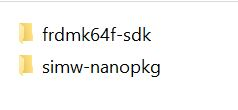
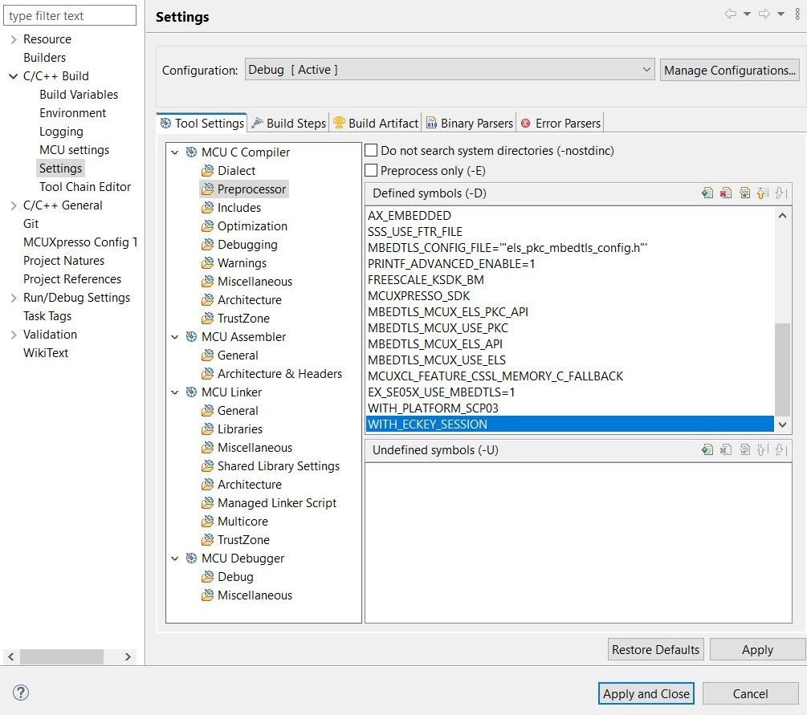

.. _ex_se05x_getinfo_k64:

SE05x Sign Example - frdm-k64
=============================

**Prequisite**

1. Download the frdmk64f SDK from https://mcuxpresso.nxp.com/en/select (version - 2.11.0). Ensure MMCAU is selected.

2. Unzip and place the sdk in parallel to the nano package as shown in the image below. Rename the sdk folder to "frdmk64f-sdk".

**Import the project**

1. Click on File, Import, Existing project to workspace and click on next.

2. Point to the "simw-nanopkg/examples/se05x_GetInfo/k64f" folder

3. Select the Project and click on Finish

.. image:: Import.JPG
  :width: 400
  :alt: Import

**Build options**

To build with Platform SCP using MbedTLS, following macros must be set in Properties->Settings->Preprocessor.

    - WITH_PLATFORM_SCP03

    - EX_SE05X_USE_MBEDTLS=1

.. image:: mbedtls_macros.jpg
  :width: 400
  :alt: folder

|

To build the example with EC Key authentication using MbedTLS, following macro must be added in Properties->Settings->Preprocessor.

    - WITH_ECKEY_SESSION

    - EX_SE05X_USE_MBEDTLS=1

|

To build with Platform SCP and EC Key authentication, following macro must be added in Properties->Settings->Preprocessor

    - WITH_ECKEY_SCP03_SESSION

    - EX_SE05X_USE_MBEDTLS=1

To build without Platform SCP or EC Key authentication, simply remove the respective macros.

**Build and Debug**

1. Click on Build and then Debug on the Quickstart panel to Build and Debug your project
