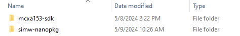
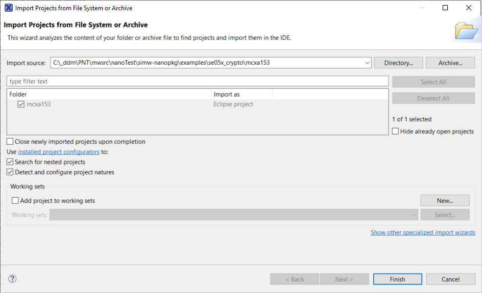

.. _ex_se05x_crypto_mcxa1543:

SE05x Crypto Example - mcxa153
===============================

**Prequisite**

1. Download the mcxa153 SDK version 2.16.100 from https://mcuxpresso.nxp.com/en/select.

2. Unzip and place the sdk in parallel to the nano package as shown in the image below. Rename the sdk folder to "mcxa153-sdk".

**Import the project**

1. Click on File, Import, Existing project to workspace and click on next.

2. Point to the "simw-nanopkg/examples/se05x_crypto/mcxa153" folder

3. Select the Project and click on Finish

**Build options**

Currently only Host crypto NONE is supported.

**Build and Debug**

1. Click on Build and then Debug on the Quickstart panel to Build and Debug your project
