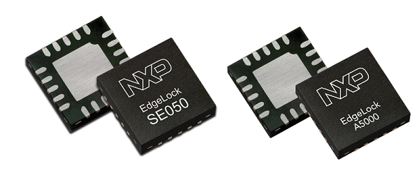
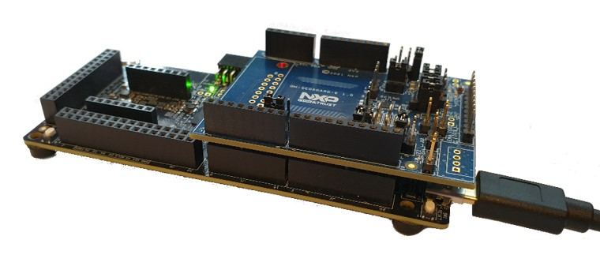
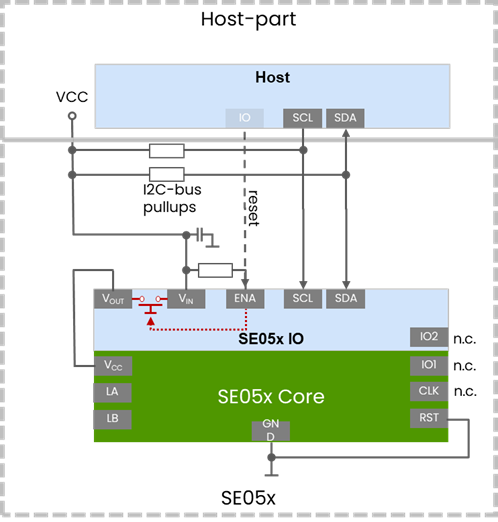
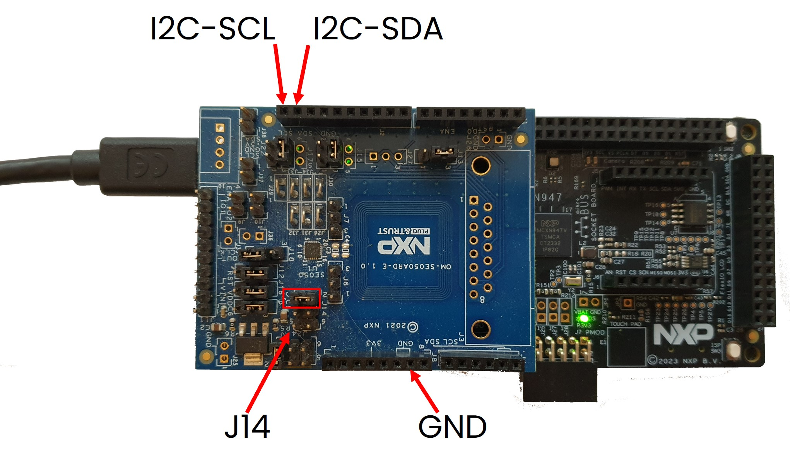
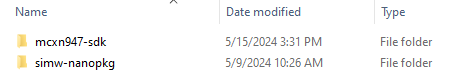
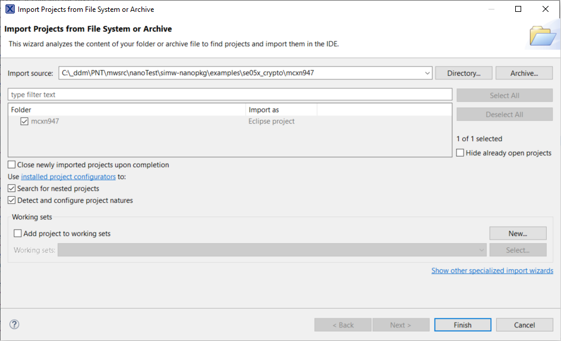
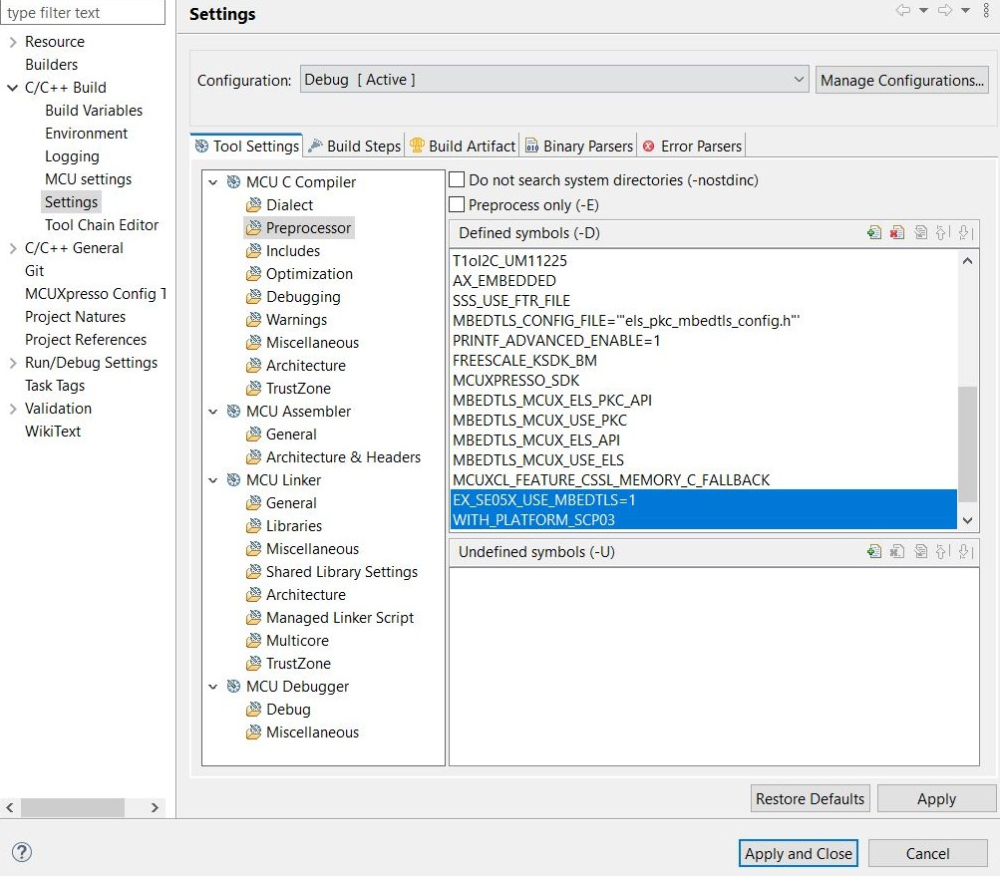

# NXP Application Code Hub

#	 	Integrating EdgeLock® SE05X to FRDM-MCX-N development boards

This demo project provides a detailed information on how to integrate the EdgeLock® SE05X Secure Element family and EdgeLock® A5000 into the FRDM development boards of MCX-N family. 
Additionally, the project contains several demo applications to showcase how to enable security on the MCX family. 

A ***Secure Element (SE)*** and ***Secure Authenticator (SA)*** are discrete companion chips which can be connected to any MPU or MCU.  
It has its own powerful core that can perform advanced cryptographic functionalities and protocols.
Both chips are resistant to advanced hardware and software attacks and can be certified with the highest security level. 
Applications which may require a secure element are data-sensitive and critical applications which involve payments, personal information, 
access control systems, government communications and many more. 
NXPs EdgeLock Secure Elements come with broad crypto functionality, and are certified and easy to scale across architectures.

 

### Connecting an external Secure Element or Secure Authenticator to an existing system

A SE and SA can be easily connected to any system, as the requirements are minimal- only power and two pins for I2C are required. 
A SE/SA can share I2C bus with other ICs, and an I2C bus can be SW emulated using 2 GPIOs. 
Additionally, it is easy to integrate thanks to the support of the Plug&Trust Middleware for the software on the host.

	

Any platform can connect to the secure element due to minimal requirements
> Hardware integration: 
> -	Only power and two pins for I2C are required
> - Secure element can share I2C bus with other ICs
> - I2C bus can be SW emulated using 2 GPIOs

> Software integration:  
> - Plug and Trust nano library offers in addition to the NXP Crypto API as well a **Mbed TLS ALT** implementation for MCU and MPU usage.
> - The full Plug & Trust Middleware ([Link](https://www.nxp.com/webapp/Download?colCode=SE05x-PLUG-TRUST-MW&appType=license)) offers beside Mbed TLS ALT as well:
>   - **PKCS11** module
>   - **OpenSSL engine** and **OpenSSL provider**
>   - PSA Crypto
>   - TPM TSS stack
>   - Android Keymaster

 

 

#### Boards: [FRDM-MCXN947](https://www.nxp.com/design/design-center/development-boards-and-designs/general-purpose-mcus/frdm-development-board-for-mcx-n94-n54-mcus:FRDM-MCXN947)

#### Expansion Boards: [OM-A5000ARD](https://www.nxp.com/products/security-and-authentication/authentication/development-board-for-edgelock-a5000-secure-authenticator:OM-A5000ARD), [OM-SE050ARD-E](https://www.nxp.com/products/security-and-authentication/authentication/edgelock-se050-development-kits:OM-SE050X), [OM-SE051ARD](https://www.nxp.com/products/security-and-authentication/authentication/edgelock-se051-development-kit:OM-SE051ARD), [OM-SE052ARD](https://www.nxp.com/products/security-and-authentication/authentication/om-se052ard-development-board-for-edgelock-se052f-secure-element:OM-SE052ARD)
#### Categories: Industrial, Secure Provisioning, Security, Cloud Connected Devices	
#### Peripherals: I2C
#### Toolchains: MCUXpresso IDE

## Table of Contents
1. [Software](#step1)
2. [Hardware](#step2)
3. [Setup](#step3)
4. [Results](#step4)
5. [FAQs](#step5) 
6. [Support](#step6)
7. [Release Notes](#step7)

Below the steps necessary to run the nano lib cryptography example on FRDM-MCXN947 are listed.

## 1. Software
- Install latest MCUxpresso from https://nxp.com/mcuxpresso.
- Download mcxn947 SDK **version 2.16.100** from https://mcuxpresso.nxp.com/en/select.
- Download the latest Plug & Trust Se05x nano library from https://github.com/NXPPlugNTrust/nano-package/

## 2. Hardware
You need either one of these SE/SA ARD development kits:
- [OM-A5000ARD](https://www.nxp.com/products/security-and-authentication/authentication/development-board-for-edgelock-a5000-secure-authenticator:OM-A5000ARD)
- [OM-SE050ARD-E](https://www.nxp.com/products/security-and-authentication/authentication/edgelock-se050-development-kits:OM-SE050X)
- [OM-SE051ARD](https://www.nxp.com/products/security-and-authentication/authentication/edgelock-se051-development-kit:OM-SE051ARD)
- [OM-SE052ARD](https://www.nxp.com/products/security-and-authentication/authentication/edgelock-se051-development-kit:OM-SE052ARD)

And a MCU baseboard, here we use:
- [FRDM-MCXN947](https://www.nxp.com/design/design-center/development-boards-and-designs/general-purpose-mcus/frdm-development-board-for-mcx-n94-n54-mcus:FRDM-MCXN947)

Place one of the ARD devkits on the MCU baseboard. The jumpers of the ARD devkit can stay in their default position as listed in [OM-SE05xARD Hardware Overview](https://www.nxp.com/webapp/Download?colCode=AN13539) respectivly [OM-SE052ARD Hardware Overview](https://www.nxp.com/webapp/Download?colCode=AN14262)

## 3. Setup

### 3.1 Prepare Files
Unzip and place the MCX SDK in parallel to the nano package as shown in the image below. Rename the MCX SDK folder to "mcxn947-sdk":

### 3.2 Import Project

1. Click on File, Import, Existing project to workspace and click on next.

2. Point to the "simw-nanopkg/examples/se05x_crypto/mcxn947" folder. This selects the "crypto" example. The "examples" folder contain other selectable examples as well. For MCX-N these examples are selectable:
   - se05x_GetInfo
   - se05x_crypto
   - se05x_mandate_scp03 
   - se05x_rotate_scp03_keys
   - se05x_sign

3. Select the Project and click on Finish

### 3.3 Build options 

To build with Platform SCP using MbedTLS, following macros must be set in Properties->Settings->Preprocessor.

    - WITH_PLATFORM_SCP03

    - EX_SE05X_USE_MBEDTLS=1

To build the example with EC Key authentication using MbedTLS, following macro must be added in Properties->Settings->Preprocessor.

    - WITH_ECKEY_SESSION

    - EX_SE05X_USE_MBEDTLS=1

|
To build with Platform SCP and EC Key authentication, following macro must be added in Properties->Settings->Preprocessor

    - WITH_ECKEY_SCP03_SESSION

    - EX_SE05X_USE_MBEDTLS=1

To build without Platform SCP or EC Key authentication, simply remove the respective macros.

### 3.4 Build and Debug

Click on Build and then Debug on the Quickstart panel to Build and Debug your project

## 4. Results
Executing the example results in output like this, showing the operations done with the secure element:

	Se05x crypto Example !
	Plug and Trust nano package - version: 1.3.0 
	Get Version ==> 
	Applet Version 7.2.0 
	ex_get_version, PASSED 
	ex_generate_nist256_key, PASSED 
	ex_set_get_nist256_key, PASSED 
	ex_nist256_sign_verify, PASSED 
	ex_set_certificate, PASSED 
	ex_ecdh, PASSED 
	ex_aes_ECB_NOPAD, PASSED 
	ex_aes_CBC_NOPAD, PASSED 
	ex_aes_CTR, PASSED 
	ex_nist256_sign_policy, PASSED 
	Close i2c device 3.
	SE05x crypto Example Success ! 

## 5. FAQs

### Are any changes needed for the different ARD boards?

- [OM-A5000ARD](https://www.nxp.com/products/security-and-authentication/authentication/development-board-for-edgelock-a5000-secure-authenticator:OM-A5000ARD) - no changes
- [OM-SE050ARD-E](https://www.nxp.com/products/security-and-authentication/authentication/edgelock-se050-development-kits:OM-SE050X) - no changes
- [OM-SE051ARD](https://www.nxp.com/products/security-and-authentication/authentication/edgelock-se051-development-kit:OM-SE051ARD) - no changes
- [OM-SE052ARD](https://www.nxp.com/products/security-and-authentication/authentication/edgelock-se051-development-kit:OM-SE052ARD) - this board with FIPS-certified IC has enforced PlatformSCP in the delivery configuration. As such PlatformSCP authentication need to be enabled (see [Build options](#build-options)) and keys  need to be set (see [PlatformSCP03](https://github.com/NXPPlugNTrust/nano-package?tab=readme-ov-file#platformscp03)). 

### How can other examples be executed?

The example gets selected in the import step. Create another project and import the wanted example from the "examples" folder. Each example has the project file for the supported platforms in a subfolder "example/platform".

## 6. Support
NXP support community for IoT secure elements: [Community Secure Authentication](https://community.nxp.com/t5/Secure-Authentication/bd-p/secure-authentication)

#### Project Metadata

<!----- Boards ----->

<!----- Categories ----->

<!----- Peripherals ----->

<!----- Toolchains ----->

Questions regarding the content/correctness of this example can be entered as Issues within this GitHub repository.

>**Warning**: For more general technical questions regarding NXP Microcontrollers and the difference in expected functionality, enter your questions on the [NXP Community Forum](https://community.nxp.com/)

## 7. Release Notes
| Version | Description / Update                           | Date                        |
|:-------:|------------------------------------------------|----------------------------:|
| 1.0     | Initial release on Application Code Hub        | July 31st 2024 |

