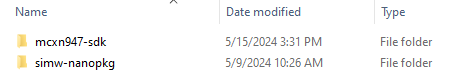
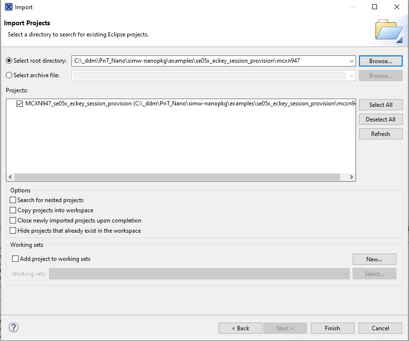

.. _ex_se05x_eckey_session_provision_mcxn947:

se05x_eckey_session_provision Example - mcxn947
=============================

**Prequisite**

1. Download the mcxn947 SDK version 2.16.100 from https://mcuxpresso.nxp.com/en/select.

2. Unzip and place the sdk in parallel to the nano package as shown in the image below. Rename the sdk folder to "mcxn947-sdk".

**Import the project**

1. Click on File, Import, Existing project to workspace and click on next.

2. Point to the "simw-nanopkg/examples/se05x_eckey_session_provision/mcxn947" folder

3. Select the Project and click on Finish

**Build options**

To build with Platform SCP using MbedTLS, following macros must be set in Properties->Settings->Preprocessor.

    - WITH_PLATFORM_SCP03

    - EX_SE05X_USE_MBEDTLS=1

.. image:: mbedtls_macros.jpg
  :width: 400
  :alt: folder

**Build and Debug**

1. Click on Build and then Debug on the Quickstart panel to Build and Debug your project
