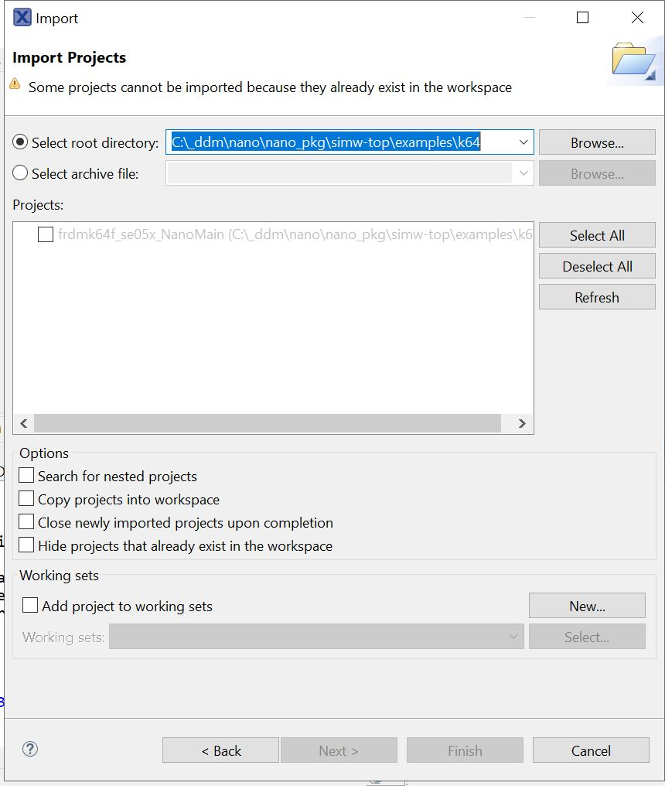
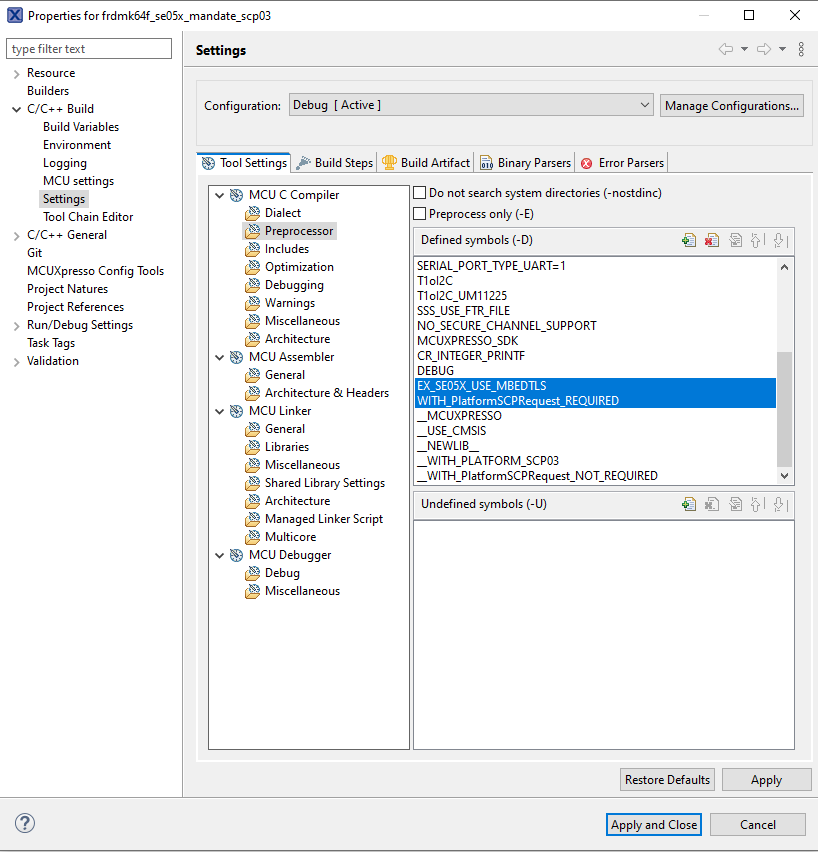
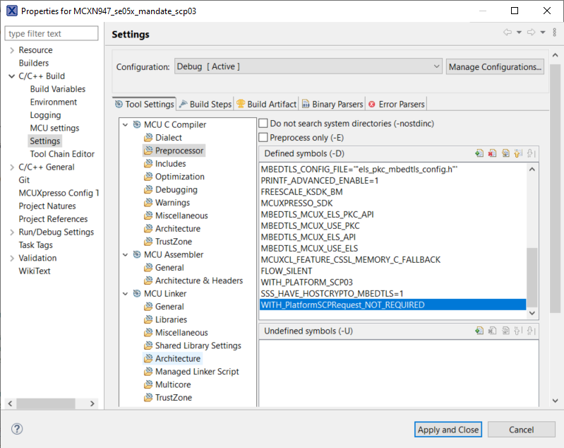

.. _ex_se05x_mandate_scp03_k64:

SE05x Mandate SCP03 Example - frdm-k64
=======================================

**Prequisite**

1. Download the frdmk64f SDK from https://mcuxpresso.nxp.com/en/select (version - 2.11.0). Ensure MMCAU is selected.

2. Unzip and place the sdk in parallel to the nano package as shown in the image below. Rename the sdk folder to "frdmk64f-sdk".

.. image:: folder.JPG
  :width: 400
  :alt: folder

**Import the project**

1. Click on File, Import, Existing project to workspace and click on next.

2. Point to the "simw-nanopkg/examples/se05x_crypto/k64" folder.

3. Select the Project and click on Finish.

4. If the example is to be built with PlatformSCP / ECKey - ensure to enable the CMAC (`#define MBEDTLS_CMAC_C`) in mbedtls config file.
file - `/frdmk64f-sdk/middleware/mbedtls/port/ksdk/ksdk_mbedtls_config.h`.

**Build options**

To build with Platform SCP using MbedTLS, following macros must be set in Properties->Settings->Preprocessor.

    WITH_PLATFORM_SCP03

    EX_SE05X_USE_MBEDTLS=1

.. image:: mbedtls_macros.jpg
  :width: 400
  :alt: folder

To build without Platform SCP, simply remove these 2 macros.

|

To set mandate Platform SCP, add the following macro in Properties->Settings->Preprocessor.

    WITH_PlatformSCPRequest_REQUIRED

If Platform SCP not required, add the following macro in Properties->Settings->Preprocessor.

    WITH_PlatformSCPRequest_NOT_REQUIRED

.. note::

	If you build demo without Platform SCP, WITH_PlatformSCPRequest_REQUIRED macro must be added.

**Build and Debug**

1. Click on Build and then Debug on the Quickstart panel to Build and Debug your project
